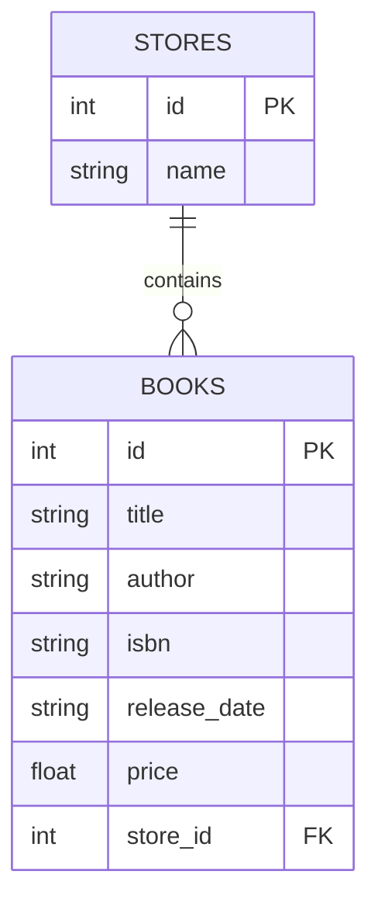

# Data Models

## Index

1. <a href="#overview">Overview</a>
1. <a href="#table-definition--attributes">Table Definition &amp; Attributes</a>
1. <a href="#relationships">Relationships</a>
1. <a href="#constructor">Constructor</a>
1. <a href="#serialization-method">Serialization Method</a>
1. <a href="#crud-helper-methods">CRUD Helper Methods</a>
1. <a href="#usage-in-the-rest-api">Usage in the REST API</a>
1. <a href="#entity-relationship-diagram">Entity Relationship Diagram</a>

---

## Overview

The BookModel class encapsulates the persistence logic for the <code>books</code> table in the SQLite database. It uses SQLAlchemy’s ORM to map Python objects to database rows, providing:

- A clear schema definition for each column.
- Helper methods to serialize instances to JSON.
- Class and instance methods for CRUD operations.

As part of the broader application, BookModel interacts with the <code>StoreModel</code> (to which it belongs) and is consumed by the book-related API resources. 

---

## Table Definition &amp; Attributes

Defined in <code>models/book.py</code>, BookModel extends <code>db.Model</code> and declares its table name and columns:

```python
from db import db

class BookModel(db.Model):
    __tablename__ = 'books'

    id            = db.Column(db.Integer, primary_key=True)
    title         = db.Column(db.String(80))
    author        = db.Column(db.String(80))
    isbn          = db.Column(db.String(40))
    release_date  = db.Column(db.String(10))
    price         = db.Column(db.Float(precision=2))
    store_id      = db.Column(db.Integer, db.ForeignKey('stores.id'))
    store         = db.relationship('StoreModel')
```

| Attribute | Type | Description |
| --- | --- | --- |
| id | Integer (PK) | Unique primary key for each book. |
| title | String(80) | Book title (unique constraint enforced at API level). |
| author | String(80) | Name of the author. |
| isbn | String(40) | International Standard Book Number. |
| release_date | String(10) | Publication date (e.g., "YYYY-MM-DD"). |
| price | Float(precision=2) | Retail price with two decimal places. |
| store_id | Integer (FK) | References the owning store’s <code>id</code> in the <code>stores</code> table. |

---

## Relationships

- <code>store_id</code> (ForeignKey): Links each book to a StoreModel record.
- <code>store</code> (relationship): Provides an ORM-level back-reference to the <code>StoreModel</code> instance.

This relationship allows eager or lazy loading of store data alongside its books.  

---

## Constructor

```python
def __init__(self, title, price, store_id, author, isbn, release_date):
    self.title        = title
    self.price        = price
    self.store_id     = store_id
    self.author       = author
    self.isbn         = isbn
    self.release_date = release_date
```

- Parameters
    - <code>title</code> (str)
    - <code>price</code> (float)
    - <code>store_id</code> (int)
    - <code>author</code> (str)
    - <code>isbn</code> (str)
    - <code>release_date</code> (str)

Ensures that all necessary fields are set on creation. 

---

## Serialization Method

```python
def json(self):
    return {
        'title'       : self.title,
        'price'       : self.price,
        'author'      : self.author,
        'isbn'        : self.isbn,
        'release_date': self.release_date
    }
```

- Converts a BookModel instance into a JSON-serializable dictionary, omitting internal IDs and foreign keys for cleaner API responses.

---

## CRUD Helper Methods

| Method | Description |
| --- | --- |
| findbytitle(cls, title) | Class method; returns the first book matching <code>title</code>, or <code>None</code> if not found. |
| savetodb(self) | Adds or updates the current instance in the database. Commits the session. |
| deletefromdb(self) | Removes the current instance from the database. Commits the session. |

These abstractions centralize data access logic, keeping API resources concise.

---

## Usage in the REST API

Within <code>resources/book.py</code>, BookModel powers the Book and BookList endpoints:

```python
from models.book import BookModel

class Book(Resource):
    @jwt_required()
    def get(self, title):
        book = BookModel.find_by_title(title)
        if book:
            return book.json()
        return {'message': 'book not found'}, 404
    # ... post, delete, put use save_to_db(), delete_from_db(), json()
```

- GET /book/&lt;/strong&gt;: Fetches a single book by title.
- POST /book/&lt;/strong&gt;: Creates a new book if none exists.
- PUT /book/&lt;/strong&gt;: Updates an existing book’s price or creates a new one.
- DELETE /book/&lt;/strong&gt;: Deletes the specified book.
- GET /books (BookList): Lists all books, serializing via <code>json()</code>.

This tight integration ensures that all API operations delegate persistence to the BookModel. 

---

## Entity Relationship Diagram

Below is an ER diagram illustrating the relationship between stores and books:



Figure: Relationship between <code>stores</code> (one) and <code>books</code> (many).  

This diagram clarifies how each book record is linked to a store, enforcing referential integrity at the database level.  

---

End of BookModel Documentation