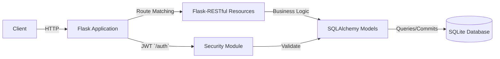

# Overview

This REST-API-PYTHON-demo repository provides a minimal yet feature-complete demonstration of a RESTful API built with Python’s Flask ecosystem. It enables clients to register users, authenticate via JWT, and manage books and stores, persisting data in an SQLite database through SQLAlchemy.

---

## Table of Contents

1. <a href="#project-purpose">Project Purpose</a>
1. <a href="#tech-stack">Tech Stack</a>
1. <a href="#high-level-architecture">High-Level Architecture</a>
1. <a href="#project-structure">Project Structure</a>
1. <a href="#key-components">Key Components</a>

---

## Project Purpose

This demo API illustrates how to:

- Expose CRUD operations for domain entities (<code>Book</code> and <code>Store</code>).
- Secure sensitive routes with JWT-based authentication.
- Structure a Flask application using Flask-RESTful for resource routing.
- Integrate SQLAlchemy for ORM and database migrations.
- Implement user registration and login flows.

All endpoints are intentionally simple, making this repository ideal for learning or bootstrapping similar Flask-based services.

---

## Tech Stack

| Technology | Purpose |
| --- | --- |
| Python 3.x | Programming language |
| Flask | Core web framework |
| Flask-RESTful | Resource-oriented routing and request parsing |
| Flask-JWT | JWT-based authentication middleware |
| SQLAlchemy | ORM for defining models and database interactions |
| SQLite | Lightweight file-based relational database |
| Werkzeug | Utility functions (<code>safestrcmp</code>) for secure password checks |

---

## High-Level Architecture



- Client sends HTTP requests to the API endpoints.
- Flask Application (<code>app.py</code>) initializes the app, extensions, and routes .
- Flask-RESTful Resources process requests, parse inputs, enforce authentication (<code>@jwt_required()</code>) and delegate to models .
- SQLAlchemy Models encapsulate persistence logic for <code>UserModel</code>, <code>BookModel</code>, and <code>StoreModel</code> .
- Security Module (<code>security.py</code>) defines <code>authenticate</code> and <code>identity</code> callbacks for JWT .

---

## Project Structure

```plaintext
PYTHON/
├── app.py              # Application factory & route registration
├── db.py               # SQLAlchemy DB instance
├── security.py         # JWT auth handlers
├── models/
│   ├── book.py         # BookModel definition
│   ├── store.py        # StoreModel definition
│   └── user.py         # UserModel definition
└── resources/
    ├── book.py         # Book & BookList resources
    ├── store.py        # Store & StoreList resources
    └── user.py         # User registration resource
```

---

## Key Components

### 1. app.py

- Initializes the Flask app, configures SQLAlchemy and JWT.
- Registers resource endpoints:
    - <code>POST   /auth</code>       – returns access token
    - <code>POST   /register</code>   – user signup
    - <code>GET/POST/PUT/...</code>   – <code>Book</code> and <code>Store</code> operations .

```python
app = Flask(__name__)
app.config['SQLALCHEMY_DATABASE_URI'] = 'sqlite:///data.db'
app.secret_key = 'SapanCrackle'
api = Api(app)

jwt = JWT(app, authenticate, identity)  # /auth
api.add_resource(UserRegister, '/register')
api.add_resource(Book, '/book/<string:title>')
api.add_resource(BookList, '/books')
api.add_resource(Store, '/store/<string:name>')
api.add_resource(StoreList, '/stores')
```

### 2. db.py

Defines the shared <code>SQLAlchemy()</code> instance for model modules to import and initialize .

```python
from flask_sqlalchemy import SQLAlchemy
db = SQLAlchemy()
```

### 3. security.py

Implements JWT callbacks:

- <code>authenticate(username, password)</code>: Validates credentials using <code>UserModel.findbyusername</code> and <code>safestrcmp</code>.
- <code>identity(payload)</code>: Retrieves user by <code>payload['identity']</code> .

```python
from werkzeug.security import safe_str_cmp
from models.user import UserModel

def authenticate(username, password):
    user = UserModel.find_by_username(username)
    if user and safe_str_cmp(user.password, password):
        return user

def identity(payload):
    user_id = payload['identity']
    return UserModel.find_by_id(user_id)
```

### 4. Models

- <code>UserModel</code> (<code>models/user.py</code>):
    - Table: <code>users</code>
    - Fields: <code>id</code>, <code>username</code>, <code>password</code>
    - Methods: <code>findbyusername</code>, <code>findbyid</code>, <code>savetodb</code> .
- <code>BookModel</code> (<code>models/book.py</code>):
    - Table: <code>books</code>, with fields for title, author, ISBN, release date, price, and <code>store_id</code> foreign key.
    - JSON serialization via <code>.json()</code>, and common CRUD methods (<code>savetodb</code>, <code>findbytitle</code>) .
- <code>StoreModel</code> (<code>models/store.py</code>):
    - Table: <code>stores</code>, one-to-many relationship to <code>BookModel</code>.
    - Includes <code>.json()</code> that nests all related books .

### 5. Resources

Each resource class subclasses <code>flask_restful.Resource</code>:

- UserRegister (<code>resources/user.py</code>): Handles <code>POST /register</code> to create new users.
- Book &amp; BookList (<code>resources/book.py</code>):
    - <code>GET /book/&lt;/code&gt; (protected), &lt;code&gt;POST&lt;/code&gt;, &lt;code&gt;PUT&lt;/code&gt;, &lt;code&gt;DELETE&lt;/code&gt; for individual books.  </code>
    - <code>GET /books</code> for listing all books.
- Store &amp; StoreList (<code>resources/store.py</code>):
    - <code>GET /store/</code>, <code>POST</code>, <code>DELETE</code> for individual stores.
    - <code>GET /stores</code> for listing all stores.

These resources parse inputs via <code>reqparse</code>, enforce validation, and coordinate with models for persistence .

---

This Overview equips you with a clear understanding of how components fit together, the responsibilities of each module, and how data flows from HTTP requests through authentication, routing, business logic, and persistence.